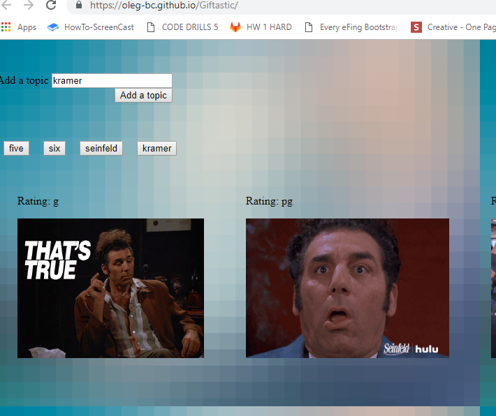

# Giftastic
A dynamic web page that populates with gifs of your choice gifs

To use enter your subject into the text box

Click the "add topic" buttons

See the button with your topic get added to the screen

Click the topic button

And enjoy the GIFs.

Gifs can paused and restarted by clicking.
The first paus will require a double click.

THIS was built with HTML, JQuery, JS, and Giphy API.

The README must contain at minimum a description of what the project is, technologies used, screenshots of essential code, and gif walkthroughs of the application functioning. Homework will be issued an incomplete if submitted with an unsatisfactory README. 

